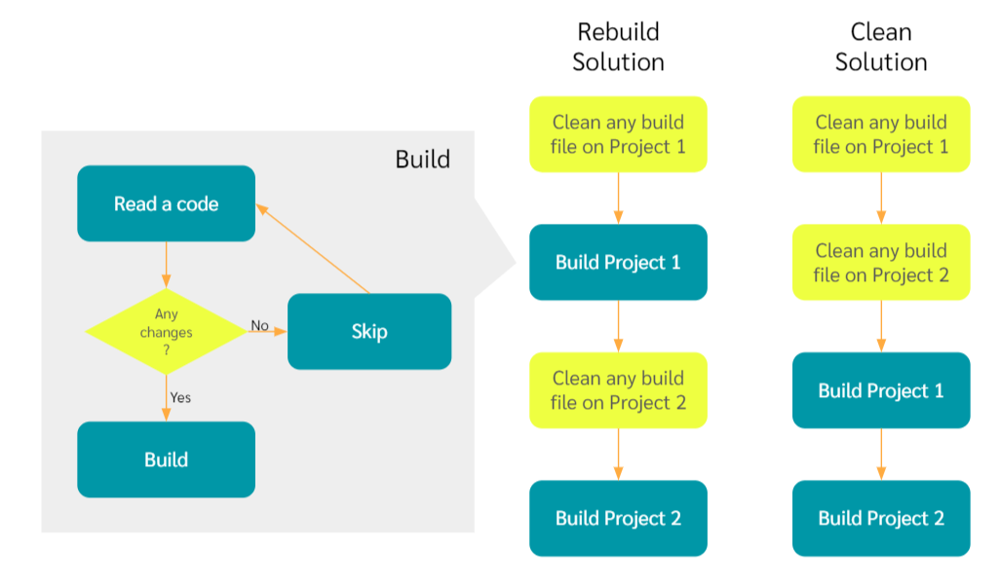
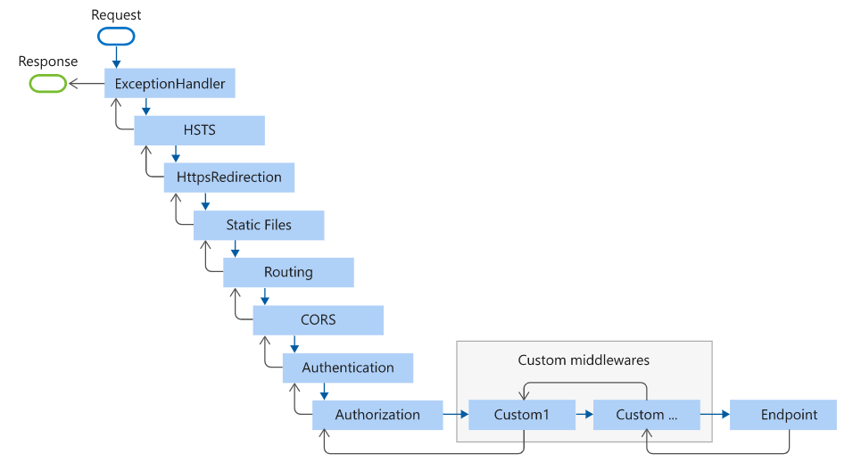

## เนื้อหาในบทความ

1. [ตรวจสอบอายุขัยของ Technology เสมอ](#expiration-date)
2. [Build ≠ Rebuild ≠ Clean](#build-rebuild-clean)
3. [จัดเรียง Middleware Pipeline ให้ดี](#middleware-pipeline)
4. [Middleware Pipeline จะ wrap error message ของเราไว้จนดูเหมือนทุกอย่างเป็น CORS policy บน Production environment](#cors-suspect)

---

## คนเราจะทำอะไรมันต้องมีแรงบันดาลใจ ว่ามั้ย?

ถ้าถามว่าอะไรบันดาลใจให้ลุกขึ้นมาเปลี่ยน framework คำตอบที่ให้กับผู้บริหารด้วยกัน คือ 

> "ได้เรื่องใช้ resource น้อยลง code อ่านง่ายขึ้น = เวลาเดฟก็สั้นลง และ performance ก็เร็วขึ้นนิดนึง แถมยังได้ LTS อีกด้วยค่ะ"

แต่ความจริงในใจก็คือ 

> อยากใช้ Syntax C# version 8

55555555

การเปลี่ยนครั้งนี้นำมาซึ่งความเข้าใจ การ refactor ให้รองรับ lib ใหม่ (รอยยิ้ม และน้ำตา) แต่ละบรรทัดของ commit นี่แทบจะเป็น blog ได้ 1 ตอน และได้ให้สัญญากับน้องๆในบริษัทเอาไว้ ว่าถ้าทำเสร็จแล้วจะเอามาถ่ายทอดให้ครบทุกความเจ็บปวด(?)กันไปเลย แต่แน่นอนว่า ไม่ใช่เนื้อหาของ blog นี้ เพราะแต่ละแอพก็คงมี lib ที่ใช้แตกต่างกัน เพราะฉะนั้น technical dept เป็นเรื่องราวของใครของมันนะคะ 5555

## Technical dept เมื่อเกิดขึ้นแล้ว ดอกเบี้ยแพงเสมอ :scream:

และ blog นี้ขอนำเสนอการหลีกเลี่ยงหลุมอากาศที่อาจจะได้เจอเมื่อตัดสินใจเปลี่ยน ASP.NET framwork version ค่ะ รู้ไว้ แล้วจะไม่เสียเวลา :wink:

### **บทเรียนที่ 0 ก่อนจะเริ่มลงมือ migrate ขอแนะนำว่าจงทำตาม [Official Walkthrough](https://docs.microsoft.com/en-us/aspnet/core/migration/22-to-30?view=aspnetcore-3.1&tabs=visual-studio) อย่างเคร่งครัด**

---

## <a name="expiration-date">หลุมที่ 1 ตรวจสอบอายุขัยของ Technology เสมอ</a>

บังเอิญเวอร์ชั่นที่ใช้อยู่คือ ASP.NET Core 2.2 อยากเรียกว่าเป็นเวอร์ชั่นลูกเมียน้อย เพราะทุกวันนี้ ASP.NET Core 2.1 ยังซัพพอร์ตอยู่เลย เราที่รีบร้อนเลี้ยวตามเทคโนโลยีก็ โดนเทคโนโลยีพามาเจอทางตัน เพราะเค้าพากันไป 3.1 หมด (และในวันนี้ .NET 5 ก็มาจ่อคอหอยแล้วค่ะ 555555)

สำหรับใครที่คิดจะเปลี่ยน asp.net framework อย่าลืมมาเช็คอายุขัยในนี้ก่อนนะ [.net core support](https://dotnet.microsoft.com/download/dotnet-core)

## เพราะทุกเทคโนโลยีมีวันหมดอายุ

ไม่มีใครรับ support อะไรไปได้ตลอดกาล ขนาด Microsoft ยังต้องประกาศไม่รับดูแล windows บางเวอร์ชั่นเมื่อเวลาผ่านไป คือคุณยังใช้ได้แหละ แต่มีปัญหาอะไรก็ต้องดูแลกันเอาเอง

### **บทเรียนที่ 1 พาตัวเองไปอยู่ใน LTS (Long Term Support) อยู่เสมอ**

---

## <a name="build-rebuild-clean">หลุมที่ 2 Build ≠ Rebuild ≠ Clean</a>

เป้าหมายของการเปลี่ยน framework ครั้งนี้คือ API โปรเจค ก้าวแรกไม่ยากเลย มุ่งตรงไปเปลี่ยน TargetFramework จาก netcoreapp2.2 เป็น netcoreapp3.1 เปลี่ยนปั๊บ **Run** พังนิดหน่อย เปลี่ยน lib บางตัว อัพเวอร์ชั่นบางตัว ปรับ code ใน startup.cs **Run** อีกรอบ เฮ้ย ผ่านละ อะไรมันจะง่ายปานนั้น สบายใจโยนลง branch เตรียมเทส ไปนอน กะว่าพรุ่งนี้ตื่นมาได้เทสชัวร์

### แต่เช้ามาพบกับความพัง

เฮ้ย ทำไมพังได้ *ก็ complier บอกเราว่าผ่านใสๆนี่นา* เล่นแง่อะไรกันอีกละเนี่ย หรือ IDE ก็มีวันเบลอๆเหมือนกัน?

## แต่เทคโนโลยีไม่มีวันโกหก (อาจจะเป็นเราที่โกหกตัวเอง 555)

ขยายความประโยคข้างบนนิดนึงกลัวทัวร์ลง คือทุกผลลัพท์ที่ผิดคาดของ machine มันมีสาเหตุเสมอค่ะ อยู่ที่เรารู้หรือไม่รู้เท่านั้นเอง (และอยู่ที่มันจะบอกเราหรือไม่ หรืออาจถูก wrap ไว้ใต้ error message อะไรบางอย่างเพื่อไม่ให้มักเกิ้ลอย่างเรางง)

และสาเหตุที่ทำให้ทุกอย่างมันผ่านใสกิ๊งขนาดนี้ก็เป็นเพราะเราลืมไปว่าการกดปุ่ม run บน visual studio 2019 มันคือการ build และ run แบบใส่ debugging tool ลงไป ประเด็นมันอยู่ตรงที่ โดยปกติการ build ทำงานแบบที่ว่า ถ้า file ไหนมี code เปลี่ยนก็เอามา build ใหม่ ถ้าไม่ ก็ข้ามไป พูดไปอาจงง ดูรูปประกอบ

เพราะฉะนั้นการ run อย่างเดียวเลยทำให้โปรเจคอื่นๆที่ไม่ได้มี code เปลี่ยนยังคงใช้ configuration แบบเดิม และส่งผลให้เราไม่เห็นผลกระทบที่โปรเจคมีต่อกันเมื่อโปรเจคนึงมีการเปลี่ยนแปลง เนื่องจากการเปลี่ยน frameworks ของ C# โปรเจคที่ reference ต่อต้องเปลี่ยนตามหรืออย่างน้อยๆต้องใช้ framework ที่ compatible ดังนั้นการเปลี่ยน framework แค่โปรเจคเป้าหมาย โดยไม่ได้เปลี่ยนปลายทางด้วยเลยก่อให้เกิด error ตามมา

### **บทเรียนที่ 2 เมื่อทำอะไรยิ่งใหญ่ให้ Clean Solution ก่อนเสมอ (ถ้า frontend ก็ลบ node_module 555)**

---

## <a name="middleware-pipeline">หลุมที่ 3 จัดเรียง Middleware Pipeline ให้ดี</a>

สำหรับคนที่อยู่บน .net core มาแต่แรกอาจจะเข้าใจ concept การใช้ middleware pipeline เป็นตัวคัดกรอง HTTP Request ที่ไหลเข้ามา ซึ่งแต่ละชั้นของ pipeline มีหน้าที่ที่ตัวเอง focus เช่น HTTPsRedirection แปลงทุก request ให้เป็น HTTPS, Authentication จัดการเรื่อง Authentication (ใช้ JWT หรืออะไรก็ว่ากันไป) เป็นต้น

และเมื่อ middleware ชั้นนั้นๆทำงานเสร็จก็จะส่ง request ให้ชั้นต่อๆไป แต่ถ้าไม่ผ่านก็ drop ได้เลยไม่เสียเวลา โดยปลายทาง API Controller ของเราจะอยู่ในชั้นในสุด Endpoint

ถามว่าวางผิดแล้วเป็นอะไรมั้ย จริงๆไม่เป็นไรค่ะ 5555 แต่บางครั้งปัญหาที่แท้จริงอาจถูกปัดตกไปเพราะ middleware ชั้นที่ควรทำหลังดันทำก่อน และการทำงานผิดลำดับยังทำให้แอพต้อง process งานที่ไม่จำเป็นทั้งๆที่บาง request อาจปัดตกไปตั้งแต่ชั้นแรกๆได้ด้วยซ้ำ

### **บทเรียนที่ 3 วาง middleware pipeline ดี มีชัยไปกว่าครึ่ง**

---

## <a name="cors-suspect">หลุมที่ 4 Middleware Pipeline จะ wrap error message ของเราไว้จนดูเหมือนทุกอย่างเป็น CORS policy บน Staging/Production environment</a>

หลังจาก upgrade libraries ไปจนหมด ถึงเวลาเอาขึ้น staging แต่ทันทีที่เอาขึ้นไปก็พบว่า API พังยับอย่างที่คิดไว้ แต่ที่แปลกคือทั้งหมดทั้งมวลบ้วนออกมาเป็น CORs problem ถึงตอนนี้ถ้าอ่านผ่านข้อข้างบนมาแล้วคงเริ่มเข้าใจแล้วว่า Middleware ขั้น CORs อาจไม่ใช่ผู้ร้ายตัวจริง

กลับมาหาเครื่องมือที่ช่วยเราสืบหาสาเหตุได้ที่ไม่ใช่ Browser inspection/Docker error message เพราะล้วนแล้วแต่เป็น tool ที่ถูก wrap มาแล้วหลายชั้น

สำหรับเราชาว C# การ Debug ExceptionHandler class OnException ไว้จะพาเราไปสู่ปัญหาที่แท้จริงได้เร็วที่สุด เป็นเครื่องมือ basic ที่ทำหน้าที่แบบเดียวกับการ try catch ด้วยการใช้ attribute ครอบ controller เป้าหมายไว้ก็ประหนึ่งว่ามี try catch อันใหญ่ครอบทุก API Controller ของเรา ทั้งยังเปิดโอกาสให้แปลง response ให้อยู่ในรูปแบบที่ต้องการก่อนส่งออกไปอีกด้วย

### **บทเรียนที่ 4 ยึดหลักการ StackTrace ไว้ให้มั่น error ที่ใกล้ต้นตอมากที่สุด เป็นของที่ real ที่สุด**

---

ก็จบลงแล้วกับมหากาพย์การเปลี่ยน framework ที่หายตัวไม่ได้งอกบล็อคเลยก็คือมัวแต่ทำสิ่งนี้อยู่นี่แหละค่ะ 555 กะว่าพอทำเสร็จแล้วคงมีเรื่องเล่ามากมาย แต่เอาตรงๆการมานั่งแจกแจงว่าต้องทำอะไรบ้างมันหาอ่านได้ทั่วไป จริงๆถ้าอ่าน Official Migration 2.2 to 3.0 ก็จะเห็นเกือบหมดแล้วว่าต้องทำอะไรบ้าง หรือการบอกว่าต้องเปลี่ยน libraries อะไรบ้างก็เช่นกัน มันมี Official Breaking Change ที่แจกแจงรายละเอียดมาเพียบแล้วว่าต้องเปลี่ยนตัวไหน และการใช้ lib ของเราก็คงไม่เหมือนกัน

แต่ความผิดพลาด เป็นสิ่งที่ถ่ายทอดออกมา แล้วช่วยลดเวลาการงมของเพื่อนมนุษย์ด้วยกันได้ดีที่สุด 5555

> Happy refactoring ค่ะ :wink: