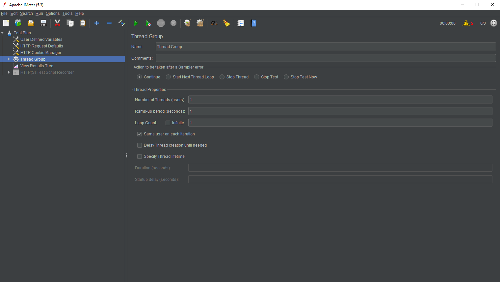
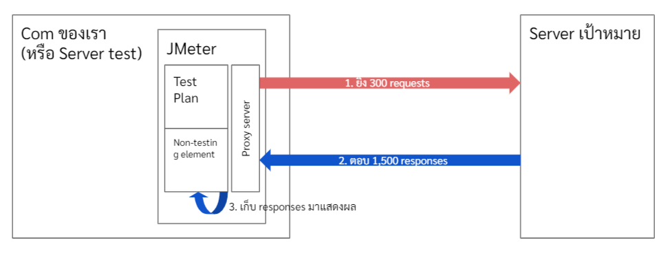

## เมื่อวันนึงเกิดสงสัยว่าเว็บที่เราทำมามันรับ user ได้ขนาดไหน

เพื่อจะหาคำตอบให้ได้ มันคงไม่ใช่การเอาพนักงาน 100 กว่าชีวิตในบริษัทมานั่งกดปุ่ม login พร้อมๆกัน นอกจากจะไม่ productive แล้วยังเป็นไปไม่ได้ในชีวิตจริง แต่การจะให้ไปจัดงาน workshop ระดม user ตัวเป็นๆมานับพันแล้วมากดปุ่ม login พร้อมกันก็คงไม่ใช่ทางออกที่ดี เพราะบางทีเว็บเราอาจรับได้แค่ 500 แล้วตายไปต่อหน้าต่อตา user นับพันก็เป็นได้

### ก็มาถึงจุดที่ต้องหา tool อะไรสักอย่างมาทดสอบให้รู้เรื่องกันไป

เครื่องมือมันมีหลากหลายแต่ในวันนี้ที่เลือกมาคือ JMeter

## ทำไม JMeter?

1. เพราะมันฟรี เป็น open source
2. เป็น Java ซึ่งเป็นหนึ่งในภาษาที่เร็วชิบหายวายป่วงถ้าใช้เพียวๆ เหมาะมากที่จะเอามาเล่นอะไรแบบนี้ จะทดสอบ performance คนอื่น ตัวเองก็ต้องเร็วก่อนอ่ะเนอะ
3. และเพราะมันเป็น Java จะรันมันขึ้นมา ขอแค่ลง jdk ซึ่งลงได้ทุกระบบปฏิบัติการณ์อยู่แล้ว เลยคิดว่าไม่น่าจะติดอะไร (ซึ่งหมายความว่าพอถึงเวลาต้อง production จริงจัง ก็น่าจะไม่ติดด้วยเช่นกัน)
4. คนทั่วไปเค้าเคลมกันว่า หน้าตามันเป็นมิตร ใช้งานง่าย ซึ่งเราก็ตกหลุม หลงเชื่อคนอื่นไป
5. มี extension libraries ที่หลากหลาย และเอามาต่อกับ Selenium ได้ด้วย ดีเลยที่บริษัทมี Robot testing ถ้าถึงเวลาเอามาพ่วงท้าย robot testing ของทีม QA ของเรามันคงจะดีไม่น้อย
6. มันแสดงผลได้หลากหลาย แต่เอาตรงๆไม่ได้คาดหวังสิ่งนั้นจาก tool นี้ค่ะ เพราะ grafana หรือ tool สร้างกราฟอื่นๆน่าจะกินขาด

ด้วยข้อดีประมาณนี้ เลยตัดสินใจให้เราเลือกสิ่งนี้มาเป็นของเล่นในวันนี้ค่ะ

## แต่พอได้ลองเล่นจริง มันไม่ง่ายค่ะ 555555555 แม่งเอ้ย

ต้องขอออกตัวก่อนว่าเราเป็นสาย เจอปุ๊บ ลองปั๊บ ถ้าติด จะกลับมาอ่าน doc ทีหลัง 55555 (ไม่ดี อย่าหาทำ) จริงๆมันก็ไม่ถึงกับลงมือเลยขนาดนั้นหรอกค่ะ เพราะในจังหวะที่เลือกก็ research มาระดับนึงแล้ว แต่ตอนลงมือเนี่ย ชอบลงไปจับทุกอย่างเอง มันมีเสน่ห์ในการได้ลองมั่วดูก่อน ไม่รู้ทำไม นิสัยนี้แก้ไม่หายจริงๆ

แต่เพราะไปลองมั่วมาแล้ว เลยตัดสินใจว่า เอ้อ สำหรับ tool นี้ ถ้าไม่อ่านก่อน ทำความเข้าใจมันก่อน ไม่เวิร์คหรอก ทำไปอ่ะทำได้ แต่จะไม่เข้าใจถึงการได้มาซึ่งผลลัพธ์ *มันไม่สนุก*

เป็นที่มาที่เราเปลี่ยนใจ ตอนแรกจะอัด tutorial ให้จบใน blog เดียว *ไม่เอาละ* ขอพื้นที่อธิบายความเป็น JMeter ก่อนดีกว่า ถ้าเราจะหอบหิ้วไปสอนน้องๆต่อ ก็อยากจะสอนเพื่อให้น้องๆเข้าใจไส้ เข้าใจที่มาที่ไป ก่อนลงทำเหมือนกัน

## JMeter ทำงานยังไง?

การทำงานของ JMeter มีหลักการคร่าวๆคือ *การสร้าง Test Plan แล้วรัน Test Plan นั้นกับ Server เป้าหมายเพื่อเก็บ response ของ server นั้นๆมาสร้างกราฟค่ะ* ดูรูปประกอบ (อาร์ตเวิร์คทุกอย่างสร้างด้วย google slides)

(สำหรับเวอร์ชั่นเก่า JMeter มีคอนเซปท์ที่เรียกว่า workbench เอาไว้แสดงผลที่เป็นผลลัพท์จากการรัน Test plan รอบนั้นๆ แต่ตอนนี้ไม่มีแล้วนะคะ ถือเป็น non-testing element ทั้งหมด)

หลักการสั้นมาก แต่การสร้าง Test plan นั้น config ได้หลากหลายตามความซับซ้อนของระบบที่เราต้องการทดสอบ จะว่าง่ายก็ง่าย จะว่ายากก็ยากสุดๆ

