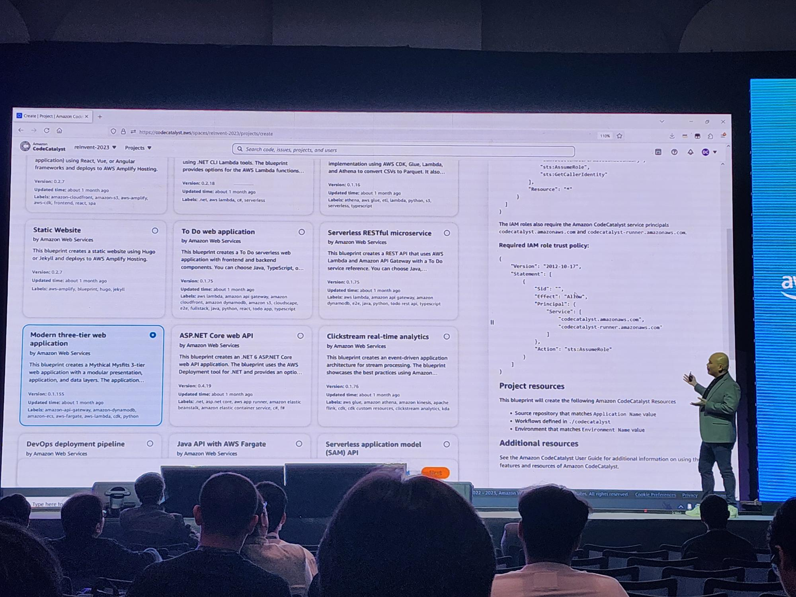
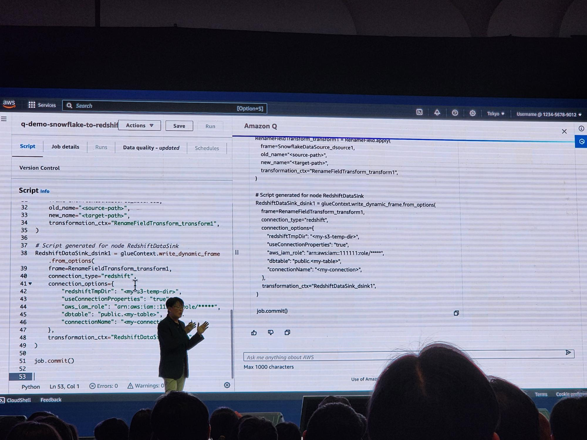

ยังจำความว้าวตอนได้ฟังเรื่อง AWS Well-architected ครั้งแรกจาก AWS Summit 2018 Keynote ได้ติดตาค่ะ (จำได้ว่าว้าว แต่ลืมจุดที่ทำให้ว้าวไปหมดเกลี้ยง) จำได้ว่าหลังจากนั้นก็ fangirl AWS event หนักมากกก งานเล็กงานใหญ่คือไปหมด ไม่ได้ไปก็ดูย้อน

จนกระทั่งย้ายงานค่ะ ซึ่งทำให้เกิดการย้าย cloud เกิดขึ้น 5555

ก็เลยไม่ได้ไปงาน AWS อีกเลย ประกอบกับ covid situation เลยห่างหายไปจากการสะสมสติ๊กเกอร์ใน tech event แบบสุดๆไปเลย แถมค้นพบว่าการจอยอีเวนท์ออนไลน์มันบ่ด้ายจีจี :pensive:

-----------

## AWS Summit 2024

### Keynote

ได้เห็นว่า Keynote ปีนี้มีนายกเศรษฐามาด้วยค่ะ รู้สึกผิดแผกแปลกตาอย่างมากกับธีมงานปกติที่ Keynote จะเอาเหล่า Tech Executive มายืนพูดปลุกระดม สร้างแรงบันดาลใจ ขายฝัน (อยากฟัง อยากมาโดนตกมาก)

ก็กลายเป็นว่ามีท่านนายกมาเป็นประธานเปิดงานให้ค่ะ อ่ะ แต่ก็มีข่าวน่ายินดี

> "ปีหน้ารอใช้ AWS region Bangkok เต็มรูปแบบกันได้เลยนะครับ"

นี่สิคะท่าน ข่าวดี!!

คุณวัตสัน Country manager ออกมาประกาศเรื่อง AWS Partner โดยเฉพาะที่เป็นสาย generative AI ก็ถือว่าเป็นอีกมูฟเพื่อการเตรียมพร้อมสู่การบุกตลาดไทยในปีหน้าอย่างชัดเจน

และคนที่เราฟังแล้วรู้สึกถึงความตื่นเต้น และพลังงานบางอย่างคือคุณ Mai Lan VP AWS ที่ออกมาพูดถึงการตอกย้ำว่าการเกาะขบวน generative AI มันสำคัญขนาดไหน มันไม่ใช้แค่ software embedded ตัว generative AI ลงไป แต่ครอบคลุมถึงเรื่องพื้นฐานที่ผู้ใช้งาน และผู้สร้างไม่ควรลืมเกี่ยวกับการใช้ AI ให้ทรงประสิทธิภาพ

> "Good Data = Good AI"

ปีนี้แบ่งเป็น 4 track เลื่อน agenda ตาแตก บอกเลยว่าเราแทบไม่มีเวลาเลือก session ให้ดีๆเลยค่ะ ทำการบ้านมาน้อยจริงๆสำหรับงานนี้

แต่สำหรับเราโทนของงานแบ่งออกเป็นสองสายชัดๆค่ะ Generative AI กับ Cyber Security แบ่งแบบนี้ด้วยความ bias ของเราล้วนๆเลยค่ะ 555

---------

## Generative AI

การเข้ามาของ Generative AI เรียกได้ว่าเปลี่ยนโลก มาถึงยุคที่ถ้าไม่ใช้ก็จะเสียเวลาทำงาน โลกใบนี้มันถูกออกแบบมาเพื่อเกิดการแข่งขัน และการแข่งขันจะเลือกผู้ที่แข็งแกร่งกว่าเสมอ

### NVIDIA

หลายคนอาจจะรู้จักชื่อนี้อยู่แล้วโดนเฉพาะเกมเมอร์ทั้งหลายว่านี่คือเจ้าแห่งการ์ดจอที่ไว้ใจได้ และหลายปีมาแล้วที่ NVIDIA พา technology stack ของตัวเองมาฝากฝังไว้กับ AWS ถ้าใครเคยใช้ AWS มาก่อนอาจจะได้เห็น EC2 Instance G series, P series ที่กำลัง GPU เดือดทะลุโลกจนน่าสงสัยว่าทำมาให้ใครใช้ ก็ NVIDIA นี่แหละค่ะคุณ

ในปีนี้ทั้งสองก็จับมือยกระดับไปอีกขั้นด้วยการออก ```Project Ceiba```


*https://ceibaerc.tech/*

เป็นที่รู้กันว่าการเทรน model เป็นเรื่องที่ใช้เงินและเวลา ด้วยความล้ำหน้าของ technology virtual GPU ที่ผสมผสานกำลังของ GPU และ CPU เป็นเนื้อเดียวกันเพื่อรีดประสิทธิภาพการเทรนและรัน model ให้ถึงขีดสุด (จะ gen ฉากใน Cyberpunk ไม่ง่ายนะคะคุณ)

#### ทีน้ีนึกสภาพกราฟฟิกการ์ดเชื่อมโยงขุมพลังกันเป็น Supercomputer ในขนาดหนึ่งตึกดูค่ะ

ทั้งนี้ก็เพื่อรองรับ demand ของการเทรน LLM model มหาศาลที่กำลังผุดขึ้นทั่วทุกมุมโลก

> เค้าว่ากันว่าลดเวลาการเทรนโมเดลได้มหาศาล และมันจะช่วยลด cost ประหยัดพลังงานได้ในระยะยาว

### Amazon CodeCatalyst + Amazon Q

แน่นอนว่ามันเป็นงานขายของอ่ะเนอะ 555

สมัยที่ยังใช้ cloud AWS ก็ตื่นตาตื่นใจเมื่อได้รู้จัก CloudFormation เป็นครั้งแรก จากการตั้ง server ที่คุ้นชิน เช่า rack ซื้อ hardward ต่อสาย กว่าจะเรียบร้อยใช้เวลาอย่างน้อยๆก็เป็นวัน

> แล้วนี่อะไรกัน เราสามารถ spin server ตามเสป็คขึ้นมาได้ใน 30 นาทีเหรอ บ้าาาาาา :satisfied:

แต่แล้วปีนี้ AWS ก็มี feature มาเหนือค่ะ



#### ก็ช็อปปิ้งกันไปเลยสิคะ อยากสร้างระบบอะไร

สำหรับเดฟอย่างเราที่ใช้ Copilot กันมาคงจะเคยชินกับให้ Copilot ช่วย generate code กันอยู่แล้ว และวันนี้ CodeCatalyst ให้เราได้มากกว่าด้วยการ gen ทั้ง software และ (virtual) hardware ให้เราซะเลย

แล้วถ้า gen ออกมาแล้วมันติดบัคอ่ะทำไง



ก็ fix, merge, build, deploy ใหม่กันไปเลยจ้าาาา ด้วย Amazon Q

> แต่เหนือสิ่งอื่นใด เราไม่คิดว่า tool นี้จะมาแทนที่ developer ได้นะคะ

จากที่คลุกคลีกับ ChatGPT, Copilot, Midjourney กันมา generative AI เหล่านี้ยังไม่สามารถสร้างสิ่งใหม่ หรือช่วยเราวิจัยในเชิงลึกได้อย่างจริงจัง แก้ design ที่ซับซ้อนด้วยตัวเองยังไม่ได้ generative AI ยังเป็น tool ที่ต้องการ prompt engineer ที่จะใช้งานเค้าได้อย่างเต็มประสิทธิภาพ

#### ตั้งแต่รู้จักกันมา ก็ทำให้เราเป็น full stack engineer ที่เขียนได้ไม่จำกัดภาษาเลยค่ะ :satisfied:

----

## Cyber Security

เรื่องความปลอดภัยที่เราเคยได้ยินครั้งแรกคือเมื่อ 9 ปีที่แล้ว (ไม่นับตอนเรียนนะ เพราะลืมไปหมดแล้ว 555) ได้ตระหนักถึงความน่ากลัวของภัยทางโลกดิจิตอลจากงาน AI ยังจำได้ขึ้นใจว่า

> สงครามทางโลกไซเบอร์มันเกิดขึ้นและจบลงในไม่กี่นาที

วันนั้นเมื่อ 9 ปีที่แล้วคือวันแรกที่เราเห็นภาพว่า

> Hacker ไม่ได้ใช้ตาเจาะระบบกันนะครับ แต่ใช้ AI ถ้าที่ไหนยังอัพ patch เดือนละครั้งก็ถือว่าช้าไปแล้ว

และในงานวันนี้เราก็เลยเน้นเข้าร่วม session ที่เกี่ยงข้องด้าน security และได้ไปยืนคุยกับหลายๆบูธที่เกี่ยงข้องกับงานด้านนี้ และที่ประทับใจจนอยากพูดถึงก็คือ CrowdStrike และ Palo Alto ค่ะ

### CrowdStrike: Global Threat 2024 report

เปิดฉากด้วยการสร้างควรกลัวก่อนเลยว่าโลกเราในปีนี้มีระดับ eCrime ที่ไวขึ้น เยอะขึ้นขนาดไหน ซึ่งการวัดตรงนี้จริงๆ target เฉพาะเหล่า hacker ชื่อดังที่โลกรู้จัก หากใครสนใจอ่านต่อเข้าไปดาวน์โหลดรีพอทกัยได้เลยค่ะที่ > https://go.crowdstrike.com/global-threat-report-2024.html

แค่เพียงครึ่งปีผ่านไประดับการเจาะระบบทั่วโลกก็ทะยานกว่า 110%

การจู่โจม cloud เติบโตจากปีก่อน 75% และข้อมูลรั่วไหลก็มากขึ้นถึง 76%

ได้เรียนรู้หนึ่งในพฤติกรรมของเหล่า hacker ที่เปลี่ยนไปจากในอดีต ไม่ว่าจะเป็น...

การเจาะระบบแล้วนิ่งไว้ รอวันที่มีคนอยากได้ข้อมูลขององค์กรเป้าหมายแล้วค่อยขายทางเข้าให้

หรือสร้าง library ให้เหล่า developer ดึงไปใช้แล้ว code, build, deploy ขึ้น cloud แล้วค่อยแผลงฤทธิ์

> การพัฒนาระบบจึงจำเป็นมากๆที่จะเริ่มจากอุปนิสัยที่ดีของนักพัฒนา

และที่น่าตื่นตาตื่นใจ คือเป้าหมายการเจาะในปีนี้ของเหล่า hacker ไม่ใช่ bank or financial business แต่กลับกลายเป็น

#### 23% ของการเจาะระบบเล็งไปที่ Technology vendor เหล่าที่ปรึกษา และผู้รับเหมาทางเทคโนโลยีอย่างพวกเรานี่เอง :scream:

ซึ่งมันก็ make sense มากเลยนะคะ เพราะเมื่อคุณเจาะเข้าระบบของคนกลุ่มนี้ได้ คุณสามารถเข้าถึงฐานข้อมูลลูกค้าอีกหลากหลายที่ที่ปรึกษาหล่านี้ให้ความช่วยเหลืออยู่อีกมากมายหลากหลาย industry

> ยิงหนึ่งได้เกินสิบ

### Palo Alto AI Security Posture

สำหรับเหล่าโปรแกรมเมอร์น่าจะคุ้นเคยกันดีเรื่อง script injection ที่สมัยก่อนเราต้องพยายามป้องกันไม่ให้คนทั่วไปสามารถอาศัยช่องโหว่ของการพิมพ์ได้อิสระในช่อง search หรือ content generator ต่างๆเพื่อแอบใส่ script หรือโปรแกรมใดใดเข้ามาทำร้ายระบบเรา หรือผู้ใช้งานคนอื่นๆได้

แต่ในวันนี้ที่โลกอนุญาตให้มี prompt ที่คุณจะใส่อะไรลงไป เพื่อ generate อะไรใดใด กระทั่ง code ชุดใหม่ขึ้นมาเองก็ยังได้

#### ระดับความปลอดภัยเลยยิ่งต้องครอบคลุม

อย่างที่เข้าใจกันว่าระบบคือ node หลายๆ node ที่ต่อกันจนเป็นกลุ่ม และแต่ละ node ก็ส่งข้อมูลที่อาจจะเป็น sensitive data ผ่านช่องทางเชื่อมต่อถึงกันตลอดเวลา การหลุดรอด การโจมตี อาจเกิดขึ้นใน node ใด หรือจุดเชื่อมระหว่าง node ไหนก็ได้

การมาของ AI เป็นการเพิ่ม node และจุดเชื่อมขึ้นมาเป็นปริมาณมากที่เราต้องคอยเฝ้าจับตาให้ดี เริ่มตั้งแต่กดูดข้อมูลเข้าระบวนการเทรน AI

- มีใครใส่ code ประหลาดเข้ามามั้ย
- เราให้สิทธิ์ data pipelline มากไปในการดึงข้อมูลรึเปล่า
- เรา mark ข้อมูลที่เป็น sensitive data เช่น บัตรประชาชน ชื่อลูกค้า เบอร์โทรศัพท์แล้วรึยัง

และเมื่อเทรน model เรียบร้อยและ deploy ขึ้นเพื่อใช้งาน

- ข้อมูลภายในขององค์กรที่ model ต้องดึงมาวิเคราะห์ไม่มี sensitive data และไม่ได้ล้วงมากเกินใช้
- ผลจากโมเดลไม่ได้ละเมิดลิขสิทธิ์ หรือมี code ที่ฝังไวรัสไว้แน่นะ?
- ไม่ได้มีความพยายามที่จะดูดข้อมูลออกจากโมเดลแบบผิดปกติใช่หรือไม่

ถ้าเราจินตนาการถึงปริมาณ prompt มากมายที่วิ่งผ่านระบบก็พบสัจธรรมที่ว่ามันเป็นไปไม่ได้เลยที่เฝ้าระวังแบบแมนวล

#### เพื่อให้ทันเวลามันก็ต้อง auto เท่านั้น!!

และการได้ไปยืนดู solution Cloud & AI security posture กับตาก็เปิดหูเปิดตาดีไม่ใช่น้อยเลย!!