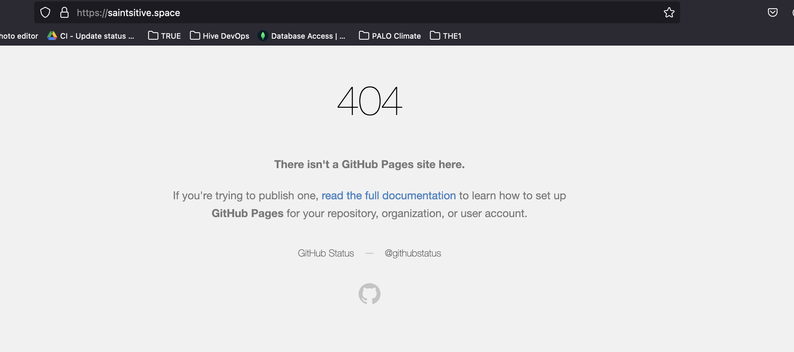

สืบเนื่องจากการฟื้นคืนชีพเพราะโดนค่า Domain name เตือนสติ เลยได้กลับมาเขียน blog อีกครั้งเมื่อไม่กี่วันก่อน หลังจากอัพเดต blog engine สุดเลิฟ Hexo เรียบร้อยก็มาถึงความพยายามรื้อถอน CD pipeline ค่ะ

ก่อนเริ่มทำก็สำรวจก่อนเลยว่าตอนนี้ Hexo มีวิธีการ deploy แบบไหน

ซึ่งสองปีผ่านไป Hexo ไม่ทำให้ผิดหวัง มี 1 one command deployment ที่จบทุกประเด็นการ deploy ขึ้น Github Pages ด้วย configuration และ ```hexo deploy``` command เดียว

เราก็จัดเลย

# ผ่าม



# :scream:

**แตก** ถถถถถถ

งงมากแม่ นี่มันเกิดอะไรขึ้น อยู่ดีๆเว็บที่ใช้งานได้มาตลอดก็เข้าไม่ถึงอีกต่อไป ไปดูที่ Github ก็ปกติ branch ที่ใช้ลง blog ทุกอย่างก็อัพเดตปกติ branch เก็บ code hexo ก็อัพเดตปกติ

ทุกอย่างปกติ

วิ่งกลับมาดู github page setting เอาละเจอของแปลก custom domain name ที่ผูกไว้ตอนนี้คือหายไป

Google สักพักก็เจอทางออก ที่แท้การจะ auto deploy github page ต้องสร้างไฟล์ CNAME ไว้ที่ root folder ด้วยค่ะ

และสำหรับ hexo เราต้องวางไว้ใน source

```
source
  |_drafts
  |_posts
  CNAME
```

เอาละ มาลองกันค่ะ

### ถ้าทุกคนยังเห็นโพสนี้ แปลว่าวิธีนี้ work 5555555