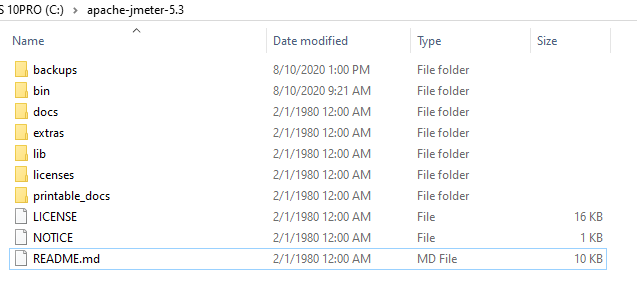
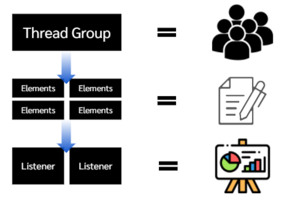

### เนื้อหาในบทความ
1. [ทำไม JMeter?](#whyjmeter)
2. [JMeter ทำงานยังไง?](#howjmeter)
3. [โครงสร้างภายในของ JMeter](#jmeterstructure)
4. [Run GUI JMeter](#runjmeter)
5. [องค์ประกอบของ Test plan](#jmetertestplan)

## เมื่อวันนึงเกิดสงสัยว่าเว็บที่เราทำมามันรับ user พร้อมๆกันได้ขนาดไหน

เพื่อจะหาคำตอบให้ได้ มันคงไม่ใช่การเอาพนักงาน 100 กว่าชีวิตในบริษัทมานั่งกดปุ่ม login พร้อมๆกัน นอกจากจะไม่ productive แล้วยังเป็นไปไม่ได้ในชีวิตจริง แต่การจะให้ไปจัดงาน workshop ระดม user ตัวเป็นๆมานับพันแล้วมากดปุ่ม login พร้อมกันก็คงไม่ใช่ทางออกที่ดี เพราะบางทีเว็บเราอาจรับได้แค่ 500 แล้วตายไปต่อหน้าต่อตา user นับพันก็เป็นได้

### ก็มาถึงจุดที่ต้องหา tool อะไรสักอย่างมาทดสอบให้รู้เรื่องกันไป

เครื่องมือมันมีหลากหลายแต่ในวันนี้ที่เลือกมาคือ JMeter


JMeter เป็นเครื่องมือในการทำ Performance testing อย่างนึง ที่ประด้วย Load test (ทดสอบว่ารับ concurrent ได้เยอะแค่ไหน) + Stress test (ทดสอบว่ารับ concurrent และ data package ได้เยอะแค่ไหน) เหมาะมากที่จะเอาไว้เป็นเครื่องมือหาคอขวดในระบบ

-------

## <a name="whyjmeter">ทำไม JMeter?</a>

1. เพราะมันฟรี เป็น open source
2. เป็น Java ซึ่งเป็นหนึ่งในภาษาที่เร็วชิบหายวายป่วงถ้าใช้เพียวๆ เหมาะมากที่จะเอามาเล่นอะไรแบบนี้ จะทดสอบ performance คนอื่น ตัวเองก็ต้องเร็วก่อนอ่ะเนอะ
3. และเพราะมันเป็น Java จะรันมันขึ้นมา ขอแค่ลง jdk ซึ่งลงได้ทุกระบบปฏิบัติการณ์อยู่แล้ว เลยคิดว่าไม่น่าจะติดอะไร (ซึ่งหมายความว่าพอถึงเวลาต้อง production จริงจัง ก็น่าจะไม่ติดด้วยเช่นกัน)
4. คนทั่วไปเค้าเคลมกันว่า หน้าตามันเป็นมิตร ใช้งานง่าย ซึ่งเราก็ตกหลุม หลงเชื่อคนอื่นไป
5. มี extension libraries ที่หลากหลาย และเอามาต่อกับ Selenium ได้ด้วย ดีเลยที่บริษัทมี Robot testing ถ้าถึงเวลาเอามาพ่วงท้าย robot testing ของทีม QA ของเรามันคงจะดีไม่น้อย
6. มันแสดงผลได้หลากหลาย แต่เอาตรงๆไม่ได้คาดหวังสิ่งนั้นจาก tool นี้ค่ะ เพราะ grafana หรือ tool สร้างกราฟอื่นๆน่าจะกินขาด

ด้วยข้อดีประมาณนี้ เลยตัดสินใจให้เราเลือกสิ่งนี้มาเป็นของเล่นในวันนี้ค่ะ

## แต่พอได้ลองเล่นจริง มันไม่ง่ายค่ะ 555555555 แม่งเอ้ย

ต้องขอออกตัวก่อนว่าเราเป็นสาย เจอปุ๊บ ลองปั๊บ ถ้าติดขัดถึงจะกลับมาอ่าน doc ทีหลัง 55555 (ไม่ดี อย่าหาทำ) จริงๆมันก็ไม่ถึงกับลงมือเลยขนาดนั้นหรอกค่ะ เพราะในจังหวะที่เลือกก็ research มาระดับนึงแล้ว แต่ตอนลงมือเนี่ย ชอบลงไปจับทุกอย่างก่อน มันมีเสน่ห์ในการได้ลองมั่วดูก่อน ไม่รู้ทำไม นิสัยนี้แก้ไม่หายจริงๆ

แต่เพราะไปลองมั่วมาแล้ว เลยตัดสินใจว่า เอ้อ สำหรับ tool นี้ ถ้าไม่อ่านก่อน ทำความเข้าใจมันก่อน ไม่เวิร์คหรอก ทำไปอ่ะทำได้ แต่จะไม่เข้าใจถึงการได้มาซึ่งผลลัพธ์ *มันไม่สนุก*

เป็นที่มาที่เราเปลี่ยนใจ ตอนแรกจะอัด tutorial ให้จบใน blog เดียว *ไม่เอาละ* ขอพื้นที่อธิบายความเป็น JMeter ก่อนดีกว่า ถ้าเราจะหอบหิ้วไปสอนน้องๆต่อ ก็อยากจะสอนเพื่อให้น้องๆเข้าใจไส้ เข้าใจที่มาที่ไป ก่อนลงมือทำเหมือนกัน

-------

## <a name="howjmeter">JMeter ทำงานยังไง?</a>

การทำงานของ JMeter มีหลักการคร่าวๆคือ *การสร้าง Test Plan แล้วรัน Test Plan นั้นผ่าน proxy ไปหา Server เพื่อป้อน request หน้าตาและปริมาณตามที่กำหนดให้ server เป้าหมายเพื่อเก็บ response ของ server นั้นๆมาสร้างผลลัพท์ค่ะ* ดูรูปประกอบ (อาร์ตเวิร์คทุกอย่างสร้างด้วย google slides)


(สำหรับเวอร์ชั่นเก่า JMeter มีคอนเซปท์ที่เรียกว่า workbench เอาไว้แสดงผลที่เป็นผลลัพท์จากการรัน Test plan รอบนั้นๆ แต่ตอนนี้ไม่มีแล้วนะคะ ถือเป็น non-testing element ทั้งหมด)

หลักการสั้นมาก แต่การสร้าง Test plan นั้น config ได้หลากหลายตามความซับซ้อนของระบบที่เราต้องการทดสอบ มันยากเพราะเว็บของเรามันมี authentication มันมี ssl มันมี WAF การจะออกแบบ request ไปหลอกเว็บเราที่ก็มี security ระดับนึงว่านี่คนนะ ไม่ใช่บอทต้องสงสัยที่ไหน (แต่จริงๆเราคือบอท 555) ก็เลยกลายเป็นเรื่องยากไปเลยโดยอัตโนมัติ

--------

## <a name="jmeterstructure">โครงสร้างภายในของ JMeter</a>

มาดูกันหน่อยว่าพอ download JMeter มาแล้วเราได้อะไรมาบ้าง



ด้วยความที่ไม่ต้อง install เวลาเรียกใช้งานจะเป็นการเรียก script ใน bin เพราะงั้นอย่าวางไว้ใน folder ลึกมากนะคะ เวลาเขียน command จะเสียใจภายหลัง 5555

โฟลเดอร์ที่เราสนใจในตอนนี้มีแค่นี้

* bin - script ต่างๆที่เราใช้รันให้ JMeter ทำงานจะอยู่ในนี้ และรวมถึง template test plan ต่างๆที่ JMeter มีให้มาเป็นเบื้องต้นด้วย
* lib - core libraries, protocols, components ของ JMeter และ extension อย่างที่บอกว่า JMeter สามารถเอา extension มาใส่เพิ่มเติมเพื่อใช้งานได้ในรูปแบบการเอา libraries นอกมาใส่ ถ้าเปิดดูข้างในก็จะเห็นว่ามี lib เบื้องต้นอยู่เพียบไปหมด (มีกระทั่ง font-awesome 555)

ส่วนที่เหลือเป็นอื่นๆ และพวก document การใช้งาน JMeter

-----

## <a name="runjmeter">Run GUI JMeter</a>


JMeter นี่มันเปิดได้ 3 วิธี
* **GUI** - Run bin/jmeter.bat เพื่อเปิด JMeter GUI ก็จะได้หน้าตาแบบข้างบน
* **CLI** - Run command ข้างล่างในโฟลเดอร์ bin

```
jmeter -n -t <ชื่อ test plan> -l <ชื่อไฟล์ที่จะใช้เก็บผลลัพท์> -H <proxy server> -P <port>
```
* **Server mode** Run bin/jmeter-server.bet ถ้ารันในโหลดนี้จะสามารถกระจาย thread ได้ เทสได้ไวขึ้น

มันมีสาเหตุที่เราควรใช้ cli มากกว่า gui เพราะตอนลองรันโดยใช้ gui แบบ thread เดียว รอบเดียว ยิง https request 2 หน้าจอ ผลที่ออกมา 300 responses นี่ทำคอมเรา RAM 16GB ถึงกับค้างไป (แต่ตอนนั้นก็ทำอย่างอื่นอีกหลายๆอย่างๆไปด้วยแหละ แหะๆ) เพราะฉะนั้นถ้าจะ load test ใส่สัก 1000 thread ก็อย่าใช้ gui เลยค่ะ สงสารเครื่องเนอะ

ถึงตรงนี้ขอพูดถึงตัว GUI นิดนึงนะคะ หลังจากเปิดมาจะมี 2 panels ซ้ายมือคือ Test plan และขวามือคือ configuration หรือ detail ของสิ่งที่เราเลือกมาจากทาง panel ซ้ายค่ะ

-----

## <a name="jmetertestplan">องค์ประกอบของ Test plan</a>

*นี่คือหัวใจของ JMeter ค่ะ*

Test plan เกิดจากการเอา **JMeter element** ต่างๆมาประกอบกันเป็นลำดับ activity เพื่อให้ **Thread Group** ที่เปรียบเสมือน user เอา activity ดังกล่าวไปกระทำบน server เป้าหมาย จากนั้นตั้ง **Listener** รอรับผลมาแสดงตามรูปแบบที่กำหนด

เห็นตัวหนามั้ยคะ

นั่นคือ องค์ประกอบทั้ง 3 ที่ทำให้เกิด test plan ขึ้นมา 1 plan



**Thread Group** - กำหนดปริมาณของ user และพฤติกรรมเบื้องต้นเช่น ทำแต่ละ action ช้าเร็วขนาดไหนได้ *1 test plan มีมากกว่า 1 thread group ได้นะ* เพื่อนำเสนอกิจกรรมของ user แต่ละกลุ่มที่แตกต่างกัน แต่ถ้าทำแบบนั้นอาจทำให้ตัวแปรมันเยอะเกินจะวิเคราะห์ได้ ต้องระวัง

**Elements** - ลำดับกิจกรรมต่างๆที่เราสามารถกำหนดให้ user ไปทำได้ โดยประกอบไปด้วย 2 elements ที่เราจะใช้บ่อย
1. **Sampler** ตัวกิจกรรมหลักๆ *(แปล: ตัวอย่างกิจกรรม)* ถ้าสมมุติเราจะทดสอบการเข้าเว็บ เราจะสร้าง Sampler > HTTP Request เป็นการบอกว่าเรากำลังจะยิง HTTP Request ไปหา Server เป้าหมาย
2. **Controller** ตัวควบคุมลำดับของ Sampler อีกที เพราะการท่องเว็บมีลำดับของมัน เช่น อาจต้องยิง HTTP Request login ก่อน เพื่อผ่านหน้า login เข้าไปในเว็บให้ได้ แล้วค่อยยิง HTTP Request logout ออกมา (แล้วจะเข้าไปทำไม..)

**Listener** - ตัวแสดงผลลัพท์ มีมากกว่า 1 ได้เหมือนกันค่ะในแต่ละรอบการเทส เช่น อยากได้ผลลัพท์กราฟ 1 อัน กับผลลัพท์แบบตารางอีก 1 อัน ก็สร้างไว้เลย 2 listener แต่หลักการจริงๆคือ listener จะอ่าน response ที่ถูกบันทึกไว้ในไฟล์ xml แล้วมาแสดงผลเฉยๆค่ะ ไม่ต้องกลัวว่ามันจะเก็บผลแยกกัน

-----

เขียนมามากมาย แต่คิดว่าน่าจะพอสำหรับการไปเริ่มลงมือทำจริงกันแล้วในบล็อคหน้า ซึ่งสิ่งที่เราจะทำกันก็คือ

### "บันทึกการท่องเว็บของเราเองด้วย JMeter Recording script แล้วเอามารันในระดับ 1000 concurrent"

จะตื่นเต้นขนาดไหน server จะล่มมั้ย โปรดติดตามตอนต่อไปค่ะ :wink: